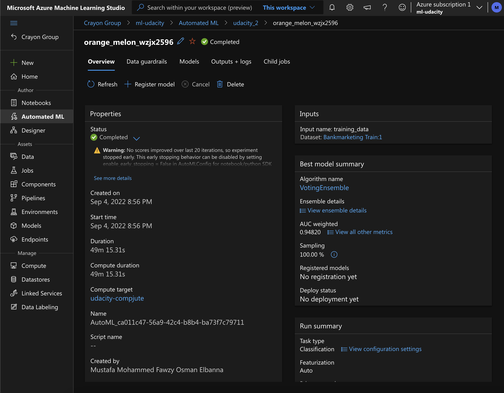

# Udacity Assignment 2

## Operationalizing Machine Learning

## Overview
In this assignment we use Azure machine learning capabilities to deploy a production model/pipeline and call it.

## Architecture

1. **Authentication** : Creating a Security Principal to communicate with the ML Workspace.
2. **AutoML** : Creating AutoML experiment and run on computer cluster.
3. **Deploy Best** : Deploying Best Model and call it by HTTP API service.
4. **Logging** : Monitor the best model about the number of requests and their performance.
5. **Swagger** : Kind of documentation for our endpoint.
6. **Consume Endpoints** : Call your endpoint.
7. **Pipeline** : Automate workflow with the Python SDK.

## Key Steps

### Authentication
Creating a security principal.

### AutoML

Creating AutoML experiment with the [Bank Marketing](https://automlsamplenotebookdata.blob.core.windows.net/automl-sample-notebook-data/bankmarketing_train.csv) Dataset inside Azure Workspace.

Creating experiment using classification, AutoML will test many models and select the best one.

*AutoML run Complete*

The best model was a **Voting Ensemble** model with **0.94820** Accuracy.

*Best model metrics*

 

### Deploy best model
Here we deploy our best model using Azure Container Instance with authentication enabled.

### Logging

We can have model logs with Azure Python SDK.

### Swagger Documentation
To consume our model using Swagger. We download the **swagger.json**, then we run the **swagger.sh** and **serve.py** files.

*Here is swagger URI*

### Consume
By running **endpoint.py** script and running it.

After modifying both the scoring_uri and the key to match the key for my service and the URI that was generated after deployment, I ran the endpoint.py script to get inference from the deployed model.

### Pipeline
With the **aml-pipelines-with-automated-machine-learning-step** notebook to create a pipeline

## Screen Recording

[Youtube Link](https://youtu.be/N1PcDPQkOQs)

## Suggestions
1. Try DeepLearning, can have better results
2. Try to balance data to avoid biased predictions
